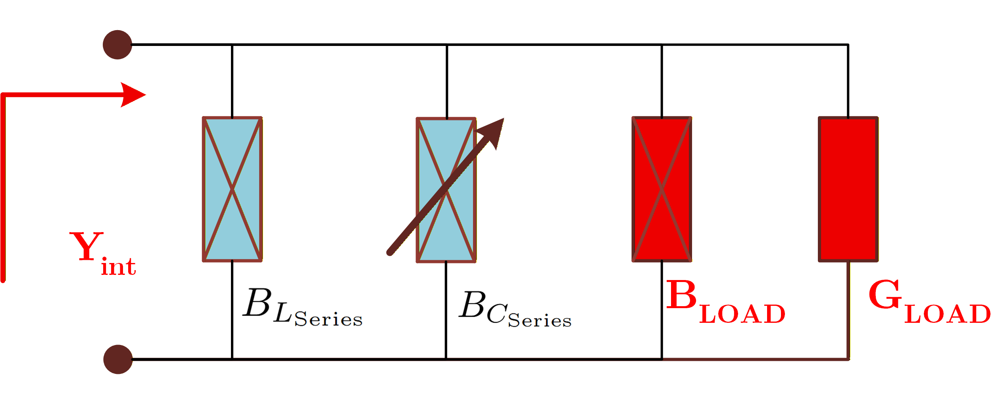
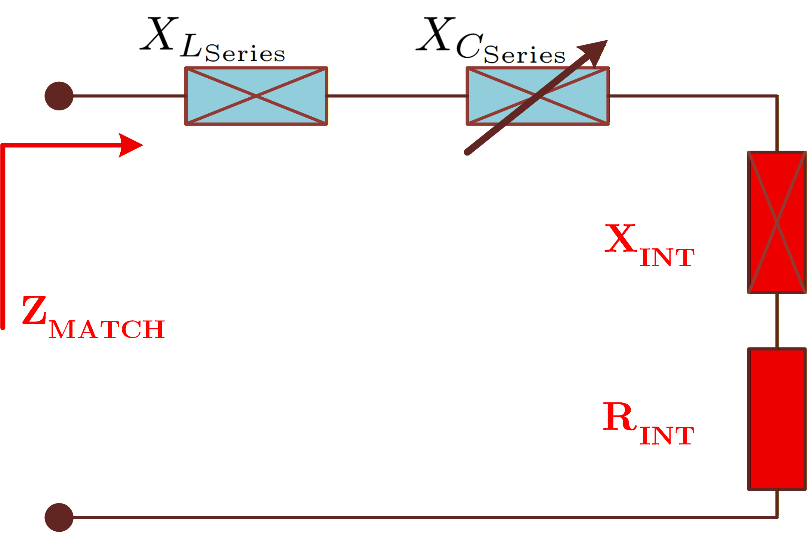
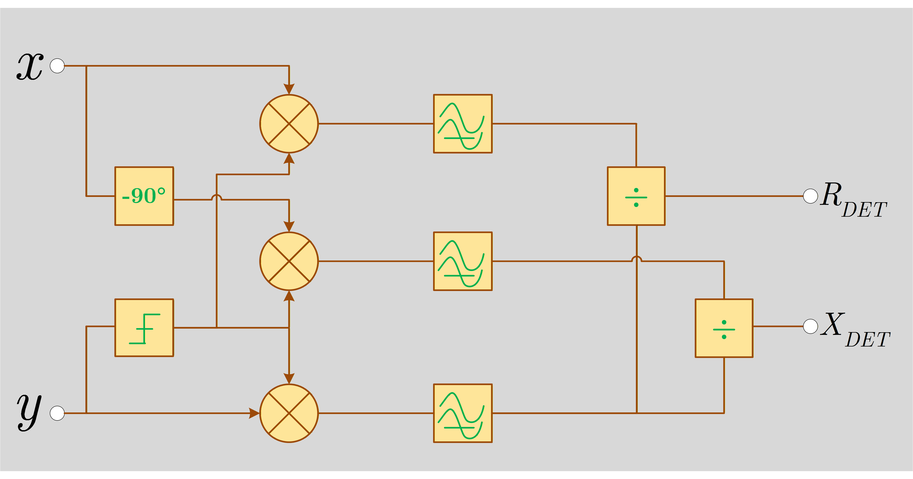

# 04 — Adaptive Control Architecture

## Cascaded loops

The architecture separates the matching task into two physical actions.

### First loop — real-part control

  
   <em>Simplified dual-band adaptive L-network parallel admittance model with tunable parallel susceptance.</em>

The shunt capacitor changes $B_{INT}$ and therefore changes

$$
R_{INT}=\frac{G_{LOAD}}{G_{LOAD}^2+B_{INT}^2}.
$$

The target is

$$
R_{INT}=R_{REF}.
$$

Unlike the series branch, $R_{INT}(B_{INT})$ is symmetric. A simple sign controller therefore encounters an ambiguous region: the same resistance can occur on two sides of the curve.

The four-quadrant solution adds a secondary criterion derived from the sign of the intermediate reactance. This forces the parallel loop toward the intended stable side rather than allowing it to diverge.

### Second loop — reactance cancellation

  
   <em>Simplified dual-band adaptive L-network series impedance model with tunable series reactance.</em>

Once the first loop has established the desired real part, the series capacitor adjusts

$$
X_{MATCH}=X_{INT}+\omega L_{SERIES}-\frac{1}{\omega C_{SERIES}}
$$

until

$$
X_{MATCH}=X_{REF}=0.
$$

This branch is monotonic over its valid region and is naturally compatible with an Up/Down counter.

## Quadrature detector

The hardware concept senses RF voltage and current. A quadrature detector extracts two DC quantities proportional to the real and imaginary parts of the measured complex impedance. The amplitude ratio cancels the absolute RF power level, which is a key reason this detector is useful for direct adaptive control.

  
   <em>Quadrature-based impedance detection architecture for extracting the resistive and reactive components.</em>

## Why this repository uses a digital twin

The MATLAB code has two distinct roles:

- `aim_closed_form.m` computes the analytical capacitor targets used to validate the design;
- `simulate_aim_tracking.m` turns those targets into discrete capacitor updates so the impedance path can be animated.

The second function is deliberately a visualization model. It does not claim to reproduce limiter delay, mixer nonlinearity, comparator hysteresis, counter clocking, or RF-MEMS switching transients.
